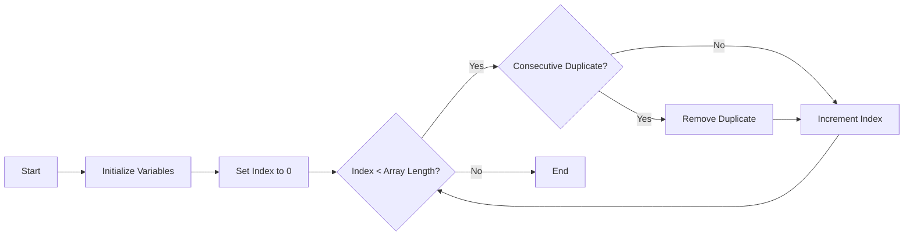

# remove-consecutive-cuplicates function

Start by iterating through the array from the beginning of each key. Keep track of the current value and the previous value. If the current value is the same as the previous one, it's a consecutive duplicate. If a consecutive duplicate is found, remove it from the array. Continue iterating until the end of the array is reached.



---

Install the packages
```
yarn
```

Run test
```
yarn test
```

Run project
```
yarn dev
```
